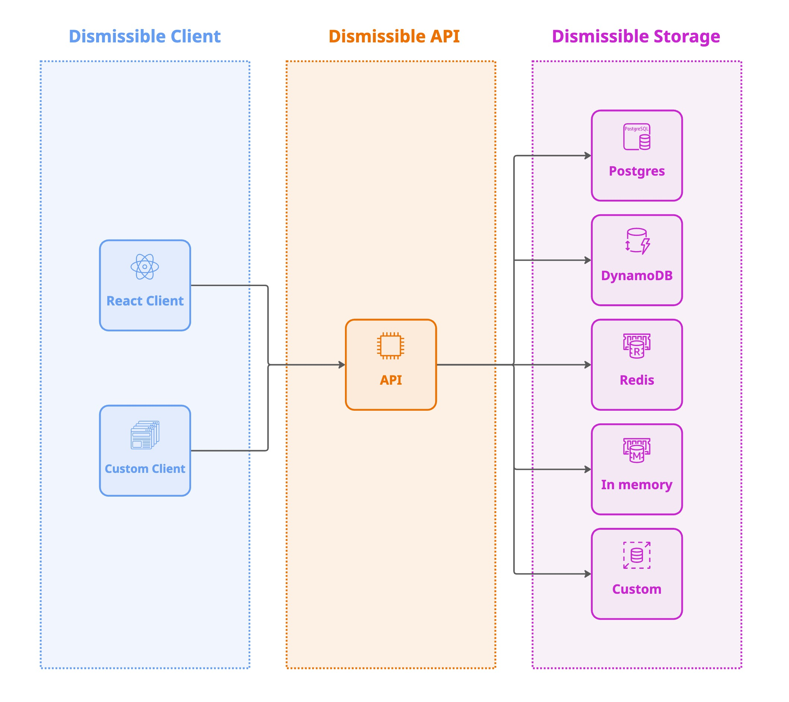

<p align="center">
  <a href="https://dismissible.io" target="_blank"></a>
</p>

<p align="center">Never Show The Same Thing Twice!</p>
<p align="center">
    <a href="https://www.npmjs.com/package/@dismissible/nestjs-core" target="_blank"></a>
    <a href="https://hub.docker.com/r/dismissibleio/dismissible-api" target="_blank"></a>
    <a href="https://github.com/dismissibleio/dismissible-api/blob/main/LICENSE" target="_blank"></a>
    <a href="https://www.npmjs.com/package/@dismissible/nestjs-core" target="_blank"></a>
    <a href="https://github.com/dismissibleio/dismissible-api" target="_blank"></a>
    <a href="https://paypal.me/joshstuartx" target="_blank"></a>
</p>

Dismissible manages the state of your UI elements across sessions, so your users see what matters, once! No more onboarding messages reappearing on every tab, no more notifications haunting users across devices. Dismissible syncs dismissal state everywhere, so every message is intentional, never repetitive.

**Visit [dismissible.io](https://dismissible.io)** for documentation, help, and support.

## Dismissible Architecture

Dismissible consists of three main components:



### Dismissible API

A RESTful API for managing dismissible items built using [NestJS](https://nestjs.com/). It provides all the basic dismissible functionality and is fully extensible.

There's several ways to run the api:

- **Docker**: A ready to run, fully configurable docker image [`dismissibleio/dismissible-api`](https://hub.docker.com/r/dismissibleio/dismissible-api).
- **All in one NestJS application**: A standalone NestJS application [`@dismissible/nestjs-api`](https://www.npmjs.com/package/@dismissible/nestjs-api) that can be extended and customzied!
- **NestJS module**: A simple NestJS module [`@dismissible/nestjs-core`](https://www.npmjs.com/package/@dismissible/nestjs-core), which contains all the core dismissible functionality that can easily be added to an existing NestJS application.

### Dismissible Storage

A place to keep the dismissible state. The Dismissible API defines a storage adapter pattern and ships with a number of options out of the box:

- **PostgreSQL**: the simplest storage option which is highly performant.
- **DynamoDB**: the AWS document store that scales infinitely.
- **In memory**: a quick way to get up an running, but isn't recommended for production systems.
- **Redis**: coming soon.
- **MySQL**: coming soon.
- **Custom**: you can create your own adapter to store the dismissible state whereever you like.

### Dismissible Client

A UI that communicates with the Dismissible API and shows/hides the items.

- **React**: We provide a convienient react library [`@dismissible/react-client`](https://www.npmjs.com/package/@dismissible/react-client) ([GitHub](https://github.com/DismissibleIo/dismissible-react-client)) that works out of the box with the Dismissible API, and allows you to completely customize the UI.
- **Custom**: You are free to create a completely custom client using whatever framework you want.

## Open Source & Free

This project is **100% open source** and **free to use**. Self-host the API with full control over your data, or use our [hosted service (coming soon)](https://dismissible.io) for zero-config convenience.

## Technologies

The following technologies are used in the Dismissible API project

- [NodeJS v24](https://nodejs.org/en/blog/release/v24.12.0)
- [NestJS](https://nestjs.com/)
- [Fastify](https://fastify.dev/)
- [Docker](https://hub.docker.com/r/dismissibleio/dismissible-api)
- [Postgres](https://www.postgresql.org/)
- [DynamoDB](https://docs.aws.amazon.com/amazondynamodb/latest/developerguide/Introduction.html)

## Quick Start

The fastest way to get started is by using the public [Docker image](https://hub.docker.com/r/dismissibleio/dismissible-api) which contains the Dismissible API and storage adapters.

```bash
docker run -p 3001:3001 \
  -e DISMISSIBLE_STORAGE_TYPE=memory \
  dismissibleio/dismissible-api:latest
```

This will launch the API using the in-memory storage, and will now be available at `http://localhost:3001`.

> [!TIP]
> **[See the full Docker documentation](./docs/DOCKER.md)**

> [!WARNING]
> The in-memory storage adapter is ephemeral and will remove all items when the server restarts. It is only useful in local development or testing scenarios. It's best to use one of the other persisted storage adapters like `postgres` or `dynamodb`.

## API Endpoints

Once the API is running, the following endpoints will be available:

| Endpoint                            | Method   | Description                                               |
| ----------------------------------- | -------- | --------------------------------------------------------- |
| `/health`                           | `GET`    | Health check endpoint                                     |
| `/v1/users/{userId}/items/{itemId}` | `GET`    | Get or create a dismissible item; creates if non-existent |
| `/v1/users/{userId}/items/{itemId}` | `DELETE` | Dismiss an item                                           |
| `/v1/users/{userId}/items/{itemId}` | `POST`   | Restore a previously dismissed item                       |

> [!TIP]
> Swagger documentation will be enabled by default or by passing the `DISMISSIBLE_SWAGGER_ENABLED=true` option which will serve interactive API docs [`http://localhost:3001/docs`](http://localhost:3001/docs).
>
> See [Swagger documentation](./docs/SWAGGER.md) for more configuration options.

## Features

The Dismissible project is jam packed with features!

- Runtimes
  - Docker image
  - NodeJS
    - All in one NestJS application
    - Core dismissible NestJS module
- Customization
  - Hooks
  - Events
  - Storage adapters
  - Custom loggers

## Documentation

We have just scratched the surface of what Dismissible is capable of! To learn more about how to configure, customize and deploy Dismissible, review the documentation below:

- **[Configuration](./docs/CONFIGURATION.md)** - An overview of all the configuration options that the Dismissible API provides.
- **[Storage](./docs/STORAGE.md)** - More details on how the storage adapters work and how to use the different ones.
- **[Docker](./docs/DOCKER.md)** - Complete Docker deployment guide.
- **[NestJS API Module](./docs/NESTJS_API_MODULE.md)** - A fully customizable NestJS module with hooks, events, and custom storage options. These docs will help you completely customize your dismissible application.

## License

This project is open source and available under the [MIT License](LICENSE).

---

<p align="center">
  <a href="https://dismissible.io">dismissible.io</a> · 
  <a href="https://github.com/dismissible/dismissible-api">GitHub</a>
</p>
